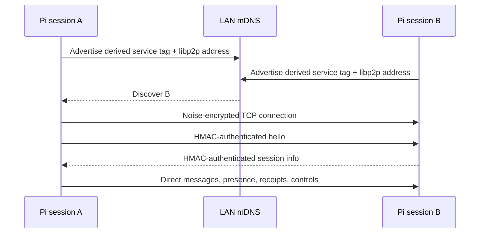

<p>
  
</p>

# Pi Intercom P2P Transport

A direct peer-to-peer transport for `pi-intercom`. Pi sessions discover each other over mDNS and exchange messages over authenticated, encrypted libp2p TCP streams. No broker is started in P2P mode.

## Install

```bash
pi install npm:pi-intercom
```

Restart Pi after installing or changing the transport configuration.

## Configuration

Every participating machine needs:

1. The same `PI_INTERCOM_P2P_KEY` value.
2. `"transport": "p2p"` in its intercom config.
3. Network access for mDNS discovery and direct TCP connections.

### 1. Set the shared key

Set a secret of at least 16 characters before starting Pi:

```bash
export PI_INTERCOM_P2P_KEY="replace-with-a-long-random-shared-secret"
```

Generate one with OpenSSL if needed:

```bash
openssl rand -hex 32
```

Copy the same value to every machine that should discover and communicate with the others. Keep it secret: possession of this key grants membership in the P2P intercom group.

### 2. Enable P2P mode

Create `~/.pi/agent/intercom/config.json`:

```json
{
  "transport": "p2p"
}
```

If `PI_CODING_AGENT_DIR` is set, the config path is instead:

```text
$PI_CODING_AGENT_DIR/intercom/config.json
```

A fuller P2P configuration can use the regular session-facing settings:

```json
{
  "transport": "p2p",
  "enabled": true,
  "confirmSend": false,
  "inboundTrigger": "always",
  "toolVisibility": "always",
  "replyHint": true,
  "status": "p2p"
}
```

| Setting | Default | Description |
|---------|---------|-------------|
| `transport` | `"broker"` | Must be `"p2p"` to use this transport. |
| `enabled` | `true` | Enables or disables intercom. |
| `confirmSend` | `false` | Confirms ordinary sends in interactive sessions. |
| `inboundTrigger` | `"always"` | Controls whether inbound messages trigger a turn: `"always"`, `"replies"`, or `"never"`. |
| `toolVisibility` | `"always"` | Exposes the tool `"always"` or `"after-first-use"`. |
| `replyHint` | `true` | Includes reply instructions with incoming messages. |
| `status` | — | Adds an optional status suffix to this session's presence. |
| `stableId` | — | Pins the session's intercom ID. Avoid putting one machine-global value in a config shared by multiple simultaneous sessions. |

`brokerCommand` and `brokerArgs` have no effect in P2P mode.

### Optional routing scope

Set the same opaque scope on sessions that should form a separate group:

```bash
export PI_INTERCOM_SCOPE_ID="team-alpha"
```

The shared key and scope are both used to derive the mDNS service name. Peers with a different key or scope do not discover each other. The scope is also checked on every received protocol envelope.

### Other environment variables

| Variable | Description |
|----------|-------------|
| `PI_INTERCOM_P2P_KEY` | Required shared secret, minimum 16 characters. |
| `PI_INTERCOM_SCOPE_ID` | Optional discovery and routing boundary. Must match across peers. |
| `PI_INTERCOM_ASK_TIMEOUT_MS` | Ask/reply timeout in milliseconds. Defaults to 1 hour. |
| `PI_INTERCOM_STABLE_ID` | Optional process-specific stable session ID; takes precedence over `stableId`. |
| `PI_CODING_AGENT_DIR` | Moves the intercom config/runtime directory from `~/.pi/agent`. |

Environment variables are read when the extension starts. Restart affected Pi sessions after changing them.

## Message History

Press **Alt+I** or run `/intercom-history` to toggle a fullscreen, read-only timeline of this session’s sent and received messages. **Alt+M** still opens the composer.

- Messages start **collapsed**, with a one-line preview. **↑/↓** selects a message; **Tab** expands/collapses it. For expanded messages, **↑/↓** scrolls through hidden content before selecting the previous/next message.
- **PgUp/PgDn** scroll through expanded content; **Home** selects the first message. Browsing or expanding pauses following, not incoming updates. Resizing preserves the source-text reading position.
- **End** or **G** selects the latest message and resumes following. New messages remain collapsed and are counted while paused.
- Vim aliases **j/k** work alongside **↓/↑** for selection and scrolling; **Tab** still expands/collapses.
- **MESSAGE** and **↳ RESPONSE** headers use distinct colors. Previews and ordinary body text use the normal text color. Expanded bodies use Pi’s Markdown renderer for headings, lists, tables, links, and syntax-highlighted fenced code.
- **Esc** or **Alt+I** closes the view without changing your draft or stopping agents.

History uses existing session records (including other branches, inherited fork history, and pre-compaction entries), in local recording order. It refreshes every 250 ms while open and works offline with saved history. LIVE means following recorded messages, not proof of delivery or processing. Incoming messages appear once recorded by Pi; timestamps come from the original message/record and may reflect different clocks. Replies are identified by reply metadata or saved ask-waiter records, never inferred from wording. Attachments show names only; exchanges solely between other sessions are not included.

## How the P2P Layer Works



### Discovery

- Each session starts a libp2p node listening on a random IPv4 TCP port (`0.0.0.0/tcp/0`).
- mDNS advertises a service tag derived from `SHA-256(shared key + scope)`.
- Advertisements contain the peer's bound libp2p addresses.
- Bound addresses are advertised even when the LAN uses public-range IP addresses.
- Discovery is best-effort and retried when mDNS or libp2p reports the peer again.

The key itself and the scope value are not advertised in plaintext. The derived service tag is visible to devices that can observe local mDNS traffic.

### Connections and security

- TCP carries the libp2p connection.
- libp2p Noise encrypts the connection.
- Yamux multiplexes streams over it.
- Every request, response, presence update, receipt, and control envelope is authenticated with HMAC-SHA-256 using `PI_INTERCOM_P2P_KEY`.
- MAC comparison uses constant-time verification.
- Protocol payloads are capped at 1 MiB.
- Remote sessions are always marked `trustedLocal: false`.

Noise encryption and shared-key authentication serve different purposes: Noise protects transport confidentiality, while the HMAC proves that the sender possesses the configured intercom key.

### Presence and routing

After discovery, peers exchange a `hello` handshake containing session metadata. The in-memory roster is updated through hello, message, and presence envelopes and removes a session when its libp2p peer disconnects.

Targets resolve in this order:

1. Exact session ID.
2. Unique case-insensitive session name.
3. Unique session ID prefix.

The roster includes live metadata such as working directory, model, status, context usage, hostname, and operating system when provided by the peer. A locally hosted SSH agent can set `PI_SSH_REMOTE`, `PI_SSH_HOSTNAME`, and `PI_SSH_SYSTEM`; its authenticated hello then marks it as `SSH <remote>` and lists the remote device identity rather than the controller machine.

## Network Requirements

P2P discovery is intended for peers on the same LAN or multicast domain:

- Allow mDNS multicast traffic (UDP 5353).
- Allow direct TCP connections between participating machines on dynamically selected ports.
- Ensure client isolation, host firewalls, VPN policy, and container networking do not block peer-to-peer traffic.
- mDNS normally does not cross routers, VLANs, or the public internet.

There is currently no manual peer address, rendezvous server, relay, NAT traversal configuration, or fixed listen-port setting. If mDNS cannot reach the other machine, the peers will not connect.

## Verify the Setup

Start Pi on at least two configured machines, then run:

```typescript
intercom({ action: "status" })
intercom({ action: "list" })
```

`list` should show the remote session, including its hostname and OS. If only the current session appears, check that both processes were restarted with matching keys/scopes and that mDNS plus direct TCP are allowed between the machines.

## P2P Limitations

- **Live peers only:** messages cannot be queued for disconnected sessions.
- **No extension bus:** extension owner election, publish, and revisioned state are broker-only features.
- **LAN discovery only:** no cross-subnet rendezvous, relay, or NAT traversal.
- **Ephemeral peer identity:** libp2p peer identity is recreated when the client restarts; intercom session identity is separate.
- **In-memory roster:** peer state disappears on disconnect or process exit.
- **Best-effort discovery:** mDNS availability depends on the host network and firewall configuration.

## Development Check

Run the focused transport tests with:

```bash
npx tsx --test p2p/client.test.ts config.test.ts
```
