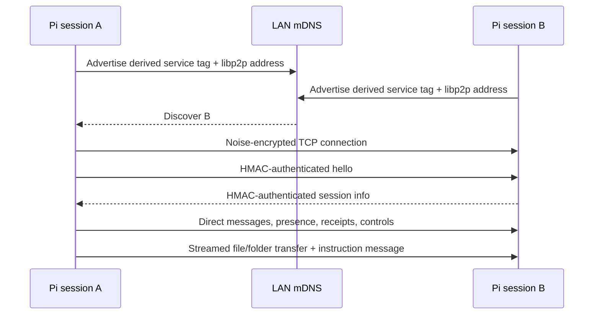

<p>
  
</p>

# Pi Intercom P2P Transport

A direct peer-to-peer transport for `pi-intercom`. Pi sessions discover each other over mDNS and exchange messages over authenticated, encrypted libp2p TCP streams. No broker is started in P2P mode.

## Install

```bash
pi install npm:pi-intercom
```

Restart Pi after installing or changing the transport configuration.

## Configuration

Every participating machine needs:

1. The same `PI_INTERCOM_P2P_KEY` value.
2. `"transport": "p2p"` in its intercom config.
3. Network access for mDNS discovery and direct TCP connections.

### 1. Set the shared key

Set a secret of at least 16 characters before starting Pi:

```bash
export PI_INTERCOM_P2P_KEY="replace-with-a-long-random-shared-secret"
```

Generate one with OpenSSL if needed:

```bash
openssl rand -hex 32
```

Copy the same value to every machine that should discover and communicate with the others. Keep it secret: possession of this key grants membership in the P2P intercom group.

### 2. Enable P2P mode

Create `~/.pi/agent/intercom/config.json`:

```json
{
  "transport": "p2p"
}
```

If `PI_CODING_AGENT_DIR` is set, the config path is instead:

```text
$PI_CODING_AGENT_DIR/intercom/config.json
```

A fuller P2P configuration can use the regular session-facing settings:

```json
{
  "transport": "p2p",
  "enabled": true,
  "confirmSend": false,
  "inboundTrigger": "always",
  "toolVisibility": "always",
  "replyHint": true,
  "status": "p2p"
}
```

| Setting | Default | Description |
|---------|---------|-------------|
| `transport` | `"broker"` | Must be `"p2p"` to use this transport. |
| `enabled` | `true` | Enables or disables intercom. |
| `confirmSend` | `false` | Confirms ordinary sends in interactive sessions. |
| `inboundTrigger` | `"always"` | Controls whether inbound messages trigger a turn: `"always"`, `"replies"`, or `"never"`. |
| `toolVisibility` | `"always"` | Exposes the tool `"always"` or `"after-first-use"`. |
| `replyHint` | `true` | Includes reply instructions with incoming messages. |
| `status` | — | Adds an optional status suffix to this session's presence. |
| `stableId` | — | Pins the session's intercom ID. Avoid putting one machine-global value in a config shared by multiple simultaneous sessions. |

`brokerCommand` and `brokerArgs` have no effect in P2P mode.

### Optional routing scope

Set the same opaque scope on sessions that should form a separate group:

```bash
export PI_INTERCOM_SCOPE_ID="team-alpha"
```

The shared key and scope are both used to derive the mDNS service name. Peers with a different key or scope do not discover each other. The scope is also checked on every received protocol envelope.

### Other environment variables

| Variable | Description |
|----------|-------------|
| `PI_INTERCOM_P2P_KEY` | Required shared secret, minimum 16 characters. |
| `PI_INTERCOM_P2P_TIMEOUT_MS` | Positive P2P request timeout in milliseconds. Defaults to 30 seconds. |
| `PI_INTERCOM_SCOPE_ID` | Optional discovery and routing boundary. Must match across peers. |
| `PI_INTERCOM_ASK_TIMEOUT_MS` | Ask/reply timeout in milliseconds. Defaults to 1 hour. |
| `PI_INTERCOM_STABLE_ID` | Optional process-specific stable session ID; takes precedence over `stableId`. |
| `PI_INTERCOM_P2P_MAX_TRANSFER_BYTES` | Maximum received P2P file transfer size. Defaults to 512 MiB. |
| `PI_INTERCOM_EVIDENCE_MAX_BYTES` | Maximum retained evidence bytes per scoped intercom session (including metadata). Defaults to 256 MiB. Full stores reject new evidence; nothing is automatically evicted. |
| `PI_CODING_AGENT_DIR` | Moves the intercom config/runtime directory from `~/.pi/agent`. |

Environment variables are read when the extension starts. Restart affected Pi sessions after changing them.

## Message History

Press **Alt+I** or **Cmd+I** (macOS terminals that forward Command via the Kitty keyboard protocol), or run `/intercom-history` to toggle a fullscreen, read-only timeline of this session’s sent and received messages. **Alt+M** still opens the composer.

- Messages start **collapsed**, with a one-line preview. **↑/↓** selects a message; **Tab** expands/collapses it. Expanded messages lock navigation: **↑/↓**, **j/k**, and paging stop at their boundaries. Collapse with **Tab** before selecting another message.
- **PgUp/PgDn** scroll through expanded content; **Home** goes to the expanded message’s top (or selects the first message when collapsed). Browsing or expanding pauses following, not incoming updates. Resizing preserves the source-text reading position.
- **End** or **G** goes to the expanded message’s bottom; when collapsed, it selects the latest message and resumes following. New messages remain collapsed and are counted while paused.
- Vim aliases **j/k** work alongside **↓/↑** for selection and scrolling; **Tab** still expands/collapses.
- Peer names get random colors that stay stable while the viewer is open; **local** is white. The twelve-color palette is reused after twelve peers. Known, unambiguous names and short IDs share their peer’s color.
- **MESSAGE** and **↳ RESPONSE** headers use distinct colors. Previews and ordinary body text use the normal text color. Expanded bodies use Pi’s Markdown renderer for headings, lists, tables, links, and syntax-highlighted fenced code.
- **Esc**, **Alt+I**, or **Cmd+I** closes the view without changing your draft or stopping agents.

History uses existing session records (including other branches, inherited fork history, and pre-compaction entries), in local recording order. It refreshes every 250 ms while open and works offline with saved history. LIVE means following recorded messages, not proof of delivery or processing. Incoming messages appear once recorded by Pi; timestamps come from the original message/record and may reflect different clocks. Replies are identified by reply metadata or saved ask-waiter records, never inferred from wording. Collapsed messages show attachment counts and names. Expand with **Tab** to inspect attachment type, language, text size, and recorded contents. File transfers show source paths on the sender and saved locations/file listings on the recipient; evidence attachments show the local evidence ID, reported provenance, coverage and exact excerpt. Sent transfers now retain their attachment details too. Older sent records without transfer metadata cannot reconstruct those details. The view reads saved records only—it does not open transferred files or rerun tools, and recorded paths may no longer exist. Exchanges solely between other sessions are not included.

## Web Monitoring Dashboard (Mobile / LAN)

Monitor all active Pi agents across your local network in real-time from your smartphone or browser:

```bash
# In any Pi session with intercom:
/intercom-web
# or
/intercom-start-web-ui [port]
```

To stop the web server:
```bash
/intercom-web stop
# or
/intercom-stop-web-ui
```

Features:
- **Mobile-friendly UI**: Modern, minimalist dark interface displaying every agent discovered on the LAN.
- **Expandable Agent Cards**: Tap any agent card to inspect the active running command (e.g. bash commands, file paths, tool queries) or the last executed action, with one-tap copy.
- **Live SSE updates**: Real-time status transitions (`idle`, `thinking`, `tool: <name>`), token context usage gauges, and relative activity times.
- **Quick Actions**: One-tap copy for `/intercom to:<agent>` handoff, full working directory path, PID, and tmux pane details.
- **Browser Push Notifications**: Optional web notifications with gentle audio chimes on mobile when an agent finishes thinking or begins running a tool.
- **Search & Filter**: Instantly filter agents by name, hostname, working directory, model, status, or executed command.


## How the P2P Layer Works



### Discovery

- Each session starts a libp2p node listening on a random IPv4 TCP port (`0.0.0.0/tcp/0`).
- mDNS advertises a service tag derived from `SHA-256(shared key + scope)`.
- Advertisements contain the peer's bound libp2p addresses.
- Bound addresses are advertised even when the LAN uses public-range IP addresses.
- Discovery is best-effort and retried when mDNS or libp2p reports the peer again.

The key itself and the scope value are not advertised in plaintext. The derived service tag is visible to devices that can observe local mDNS traffic.

### Connections and security

- TCP carries the libp2p connection.
- libp2p Noise encrypts the connection.
- Yamux multiplexes streams over it.
- Every request, response, presence update, receipt, and control envelope is authenticated with HMAC-SHA-256 using `PI_INTERCOM_P2P_KEY`.
- MAC comparison uses constant-time verification.
- Message protocol payloads are capped at 1 MiB.
- File data uses a separate length-prefixed, backpressured stream and is never buffered as one message.
- Remote sessions are always marked `trustedLocal: false`.

Noise encryption and shared-key authentication serve different purposes: Noise protects transport confidentiality, while the HMAC proves that the sender possesses the configured intercom key.

### Presence and routing

After discovery, peers exchange a `hello` handshake containing session metadata. The in-memory roster is updated through hello, message, and presence envelopes and removes a session when its libp2p peer disconnects.

Targets resolve in this order:

1. Exact session ID.
2. Unique case-insensitive session name.
3. Unique session ID prefix.

An explicit Pi `/name` is advertised unchanged. Otherwise the runtime-only name is the normalized `<project>@<machine>` (project-directory basename and logical hostname, preferring `PI_SSH_HOSTNAME`). Duplicate runtime names remain valid but are displayed with a short session ID; unique names omit it. In the prompt editor, type `@@` at the start of a line or after whitespace to autocomplete live peers by name, cwd, hostname, or short ID.

The roster includes live metadata such as working directory, model, status, context usage, hostname, and operating system when provided by the peer. A locally hosted SSH agent can set `PI_SSH_REMOTE`, `PI_SSH_HOSTNAME`, and `PI_SSH_SYSTEM`; its authenticated hello then marks it as `SSH <remote>` and lists the remote device identity rather than the controller machine.

### File and folder transfer

With the P2P transport, `send`, `ask`, and `reply` accept local file or folder paths alongside the instruction message:

```typescript
intercom({
  action: "send",
  to: "worker",
  message: "Review these files and apply the configuration.",
  paths: ["./config.json", "./templates"]
})
```

Relative paths resolve from the sending session's working directory. The receiver validates paths, rejects symlinks and non-regular files, streams data into a temporary directory, verifies SHA-256 hashes, and only then delivers the message. Completed transfers are stored under `~/.pi/agent/intercom/inbox/<session-id>/<message-id>/`; the receiving agent gets that absolute path in a generated context attachment.

Transfers default to a 512 MiB total limit and 10,000 entries. They do not overwrite an existing transfer. The broker transport continues to support inline `attachments`, but not `paths`.

## Retained tool evidence

When intercom is enabled, text tool results are automatically retained **locally**. Nothing is automatically shared. Results receive an evidence UUID; use `intercom_evidence` to recover them without rerunning the tool:

```typescript
intercom_evidence({ action: "list", query: "npm test", limit: 10 })
intercom_evidence({ action: "read", id: "<evidence-uuid>", offset: 180, limit: 30 })
```

Lookup searches metadata (tool name, tool-call ID, inputs, and received findings), not full output bodies. `offset` is 1-based: result index for `list`, line number for `read`. Lists return at most 50 records; reads return at most 200 lines/16,000 output characters plus bounded provenance. Long lines are marked when clipped; reads normalize line separators. The retained `output.txt` path is also returned for exact byte-level inspection.

### Explicit sharing through intercom

With P2P enabled on both agents, use `evidenceId` on `send`, `ask`, or `reply`:

```typescript
intercom({
  action: "send",
  to: "reviewer",
  message: "Two tests failed. A cancellation race is a hypothesis, not a confirmed cause.",
  evidenceId: "<evidence-uuid>",
  evidenceOffset: 180,
  evidenceLimit: 20
})
```

The harness transfers the selected artifact immediately, without asking the model to reproduce its output. The receiver verifies its hash, commits a local copy under a **new local UUID**, then receives the finding, an exact line excerpt, and a retrieval reference. The finding is limited to 2,000 characters; excerpts are limited to 100 lines/4,000 characters. `evidenceId` cannot be combined with `paths` or inline attachments.

Full outputs stay on disk, not in the peer's context. They remain readable after the sender disconnects or deletes its original. Both peers must support the evidence transfer protocol; older peers fail rather than silently accepting an unusable reference. Like `paths`, evidence sharing requires P2P mode, including between agents on the same machine. Local retention/lookup also work in broker mode and offline.

### Compaction, provenance, and cleanup

Before each model request, a small index of the five latest retained results is rebuilt from disk. This does not replace Pi's compactor or replay entire outputs. Older records remain searchable after repeated compaction, extension reload, or resuming the same session. New sessions/forks have separate stores unless configured with the same stable intercom ID. Evidence from other branches is historical, not proof of the current workspace state.

Artifacts live under `$PI_CODING_AGENT_DIR/intercom/evidence/<scope-and-session-hash>/` (default agent directory: `~/.pi/agent`). Each has `record.json` and `output.txt`, with private directory/file permissions. Metadata includes the source tool invocation, timestamp, branch entry, tool error flag, and Git commit/dirty state sampled after execution—not an atomic filesystem snapshot. Inputs are bounded and marked if shortened. Peer-reported origin is preserved separately from the peer that actually sent the artifact.

Capture preserves the tool's **text projection**, not hidden tool details or images. For built-in `bash`, an available local full-output spill file is copied before it can disappear. Other tools may already have truncated their results; completeness is recorded as reported or unknown. A missing spill file is explicitly marked partial. Evidence reads and intercom messaging are not recursively captured.

Evidence is kept until explicit cleanup:

```typescript
intercom_evidence({ action: "delete", id: "<evidence-uuid>" })
```

Deletion affects only this session's local copy, not previously shared copies or the session transcript. Capacity and capture failures are reported without hiding the original tool result or evicting old evidence. Failed transfers do not inject a finding as though its evidence were available. Interrupted-process `.partial-*` directories, if any, can be explicitly removed from the store during maintenance. Temporary transfer storage has its own existing transfer limit.

**Privacy:** outputs and tool inputs can contain secrets. Inspect before sharing; automatic retention is not redaction, and the local cap is per session, not machine-wide. A peer's output is untrusted data—not permission to execute instructions embedded in a log. One runtime must own each intercom session ID; shared-key authentication does not independently attest the claimed original tool execution.

## Network Requirements

P2P discovery is intended for peers on the same LAN or multicast domain:

- Allow mDNS multicast traffic (UDP 5353).
- Allow direct TCP connections between participating machines on dynamically selected ports.
- Ensure client isolation, host firewalls, VPN policy, and container networking do not block peer-to-peer traffic.
- mDNS normally does not cross routers, VLANs, or the public internet.

There is currently no manual peer address, rendezvous server, relay, NAT traversal configuration, or fixed listen-port setting. If mDNS cannot reach the other machine, the peers will not connect.

## Verify the Setup

Start Pi on at least two configured machines, then run:

```typescript
intercom({ action: "status" })
intercom({ action: "list" })
```

`list` should show the remote session, including its hostname and OS. If only the current session appears, check that both processes were restarted with matching keys/scopes and that mDNS plus direct TCP are allowed between the machines.

## P2P Limitations

- **Live peers only:** messages cannot be queued for disconnected sessions.
- **No extension bus:** extension owner election, publish, and revisioned state are broker-only features.
- **LAN discovery only:** no cross-subnet rendezvous, relay, or NAT traversal.
- **Ephemeral peer identity:** libp2p peer identity is recreated when the client restarts; intercom session identity is separate.
- **In-memory roster:** peer state disappears on disconnect or process exit.
- **Best-effort discovery:** mDNS availability depends on the host network and firewall configuration.

## Development Check

Run the focused transport tests with:

```bash
npx tsx --test p2p/client.test.ts p2p/transfer.test.ts config.test.ts
```
